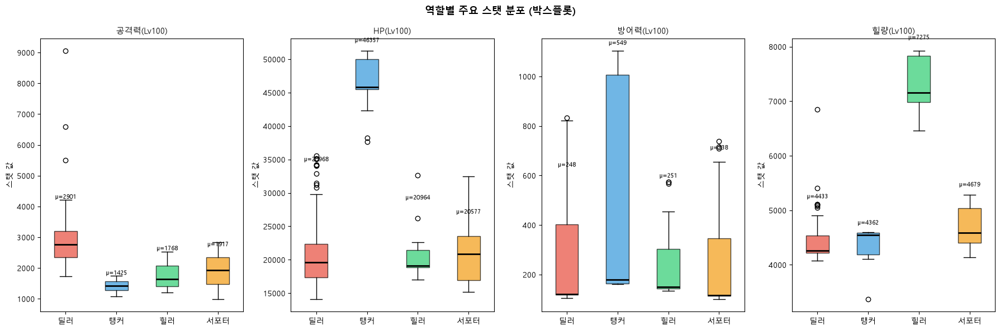
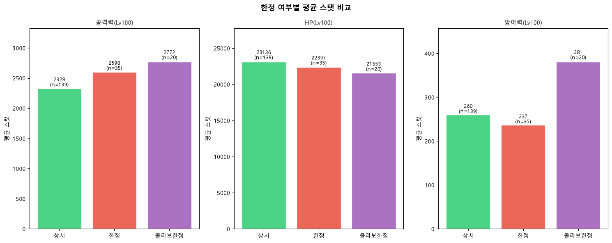
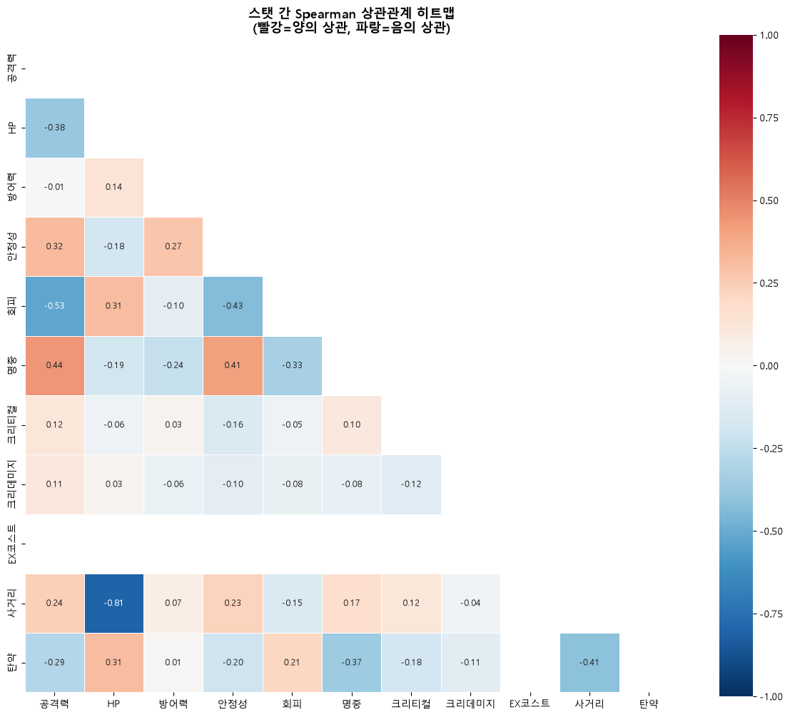

# 블루아카이브 캐릭터 스탯·메타 데이터 분석

> **"스탯 숫자가 메타를 설명할 수 있는가?"**  
> 서브컬처 모바일 RPG 블루아카이브의 캐릭터 데이터(194명, 48컬럼)로  
> EDA → 통계 검증 → 클러스터링 → 예측 모델까지 전체 분석 워크플로를 구축하는 포트폴리오 프로젝트.

> 이 프로젝트의 분석 워크플로 전체는 **Claude Code**로 진행했습니다.

---

## 주요 발견 (EDA Phase 1 완료)

### 발견 1 — 역할별 스탯 프로파일이 뚜렷하게 분리된다

딜러(빨강)·탱커(파랑)·힐러(초록)·서포터(노랑)의 스탯 박스플롯.  
탱커의 HP가 다른 역할보다 압도적으로 높고, 힐량은 힐러·서포터에만 집중된 구조가 확인됩니다.  
→ **Phase 3 클러스터링에서 역할과 유사한 클러스터가 자연스럽게 재발견될 것으로 예상.**



---

### 발견 2 — 한정 픽업 학생이 상시 학생보다 평균 스탯이 일관되게 높다

한정(빨강) 학생의 공격력·HP·방어력 평균이 상시(초록)보다 높게 나타납니다.  
단, 역할 구성 차이(한정 학생 중 딜러·★3 비율이 더 높음)를 통제해야 실제 "한정 보너스"가 있는지 판단 가능합니다.  
→ **Phase 2 통계 검증에서 역할·레어도를 통제한 t-검정으로 확인 예정.**



---

### 발견 3 — 스탯 간 상관관계가 역할 설계 구조를 반영한다

공격력·크리티컬이 함께 높은 양의 상관(딜러 설계)과  
HP·방어력이 함께 높은 양의 상관(탱커 설계)이 히트맵에서 확인됩니다.  
→ **상관이 높은 스탯 쌍은 PCA로 압축 후 클러스터링에 활용 예정.**



---

## 분석 파이프라인

```
[Phase 1 ✅] EDA
      ↓ 데이터 구조 파악, 분포 탐색, 가설 설정
[Phase 2 🚧] 통계 검증
      ↓ ANOVA, t-검정, Spearman 상관으로 EDA 가설 검증
[Phase 3 🚧] 클러스터링 (비지도 학습)
      ↓ K-means로 데이터 기반 "메타 유형" 발굴
[Phase 4 🚧] 예측 모델 (지도 학습)
      → RandomForest + SHAP으로 고레어도를 결정하는 스탯 요소 해석
```

### Phase 1 — EDA `notebooks/01_eda.ipynb` ✅

| 분석 | 방법 | 결과 파일 |
|------|------|-----------|
| 결측치·이상치 탐색 | 컬럼별 결측 집계 | — |
| 범주 분포 | 역할·레어도·속성·지형 막대그래프 | `eda_category_dist.png` |
| 스탯 분포 전체 조망 | 히스토그램 + 평균/중앙값 | `eda_stat_distributions.png` |
| 역할별 스탯 비교 | 박스플롯 + 정규화 프로파일 | `eda_role_boxplot.png` |
| 레어도별 비교 | 겹치는 히스토그램 | `eda_rarity_dist.png` |
| 한정 vs 상시 | 그룹별 평균 막대 + 교차표 | `eda_limited_stats.png` |
| 지형 적응도 | 등급 분포 + 지형 간 상관 | `eda_terrain.png` |
| 스탯 상관관계 | Spearman 히트맵 | `eda_correlation.png` |

### Phase 2 — 통계 검증 `notebooks/02_statistics.ipynb` 🚧 Work in progress

```
[ ] 역할별 공격력 차이: ANOVA + Tukey HSD post-hoc
[ ] 레어도별 스탯 차이: ANOVA (표본 불균형 고려)
[ ] 한정 vs 상시: 독립 표본 t-검정 (역할·레어도 층화 후)
[ ] EX코스트 ↔ 공격력: Spearman + 산점도 (회귀선)
```

### Phase 3 — 클러스터링 `notebooks/03_clustering.ipynb` 🚧 Work in progress

```
[ ] StandardScaler 정규화 (HP 스케일 문제 해결)
[ ] Elbow Method + Silhouette Score로 최적 K 결정
[ ] K-means 클러스터링 + PCA 2D 시각화
[ ] 클러스터별 "메타 유형" 해석 및 명명
[ ] 한정 학생의 클러스터 집중도 분석
```

### Phase 4 — 예측 모델 `notebooks/04_prediction.ipynb` 🚧 Work in progress

```
[ ] ★3 레어도 여부 예측: RandomForest + LogisticRegression
[ ] 교차검증(5-fold CV)으로 과적합 방지
[ ] Feature Importance + SHAP 해석
[ ] 한정 여부 예측 및 혼동 행렬 분석
```

---

## 데이터 출처 및 한계

### 데이터 출처

| 데이터 | 출처 | 수집 방법 | 라이선스 |
|--------|------|-----------|----------|
| 학생 스탯·스킬 (194명, 48컬럼) | [SchaleDB](https://schaledb.com) GitHub JSON | `src/collectors/collect_students.py` | CC BY-NC-SA 4.0 |

### 데이터 한계 (정직하게)

| 한계 | 영향 | 대안 |
|------|------|------|
| **출시일 없음** | 시계열 분석 불가 — 언제 출시된 학생인지 모름 | 나무위키·Fandom 위키 크롤링으로 보완 가능 |
| **194명 소규모** | ML 모델 과적합 위험, 교차검증 결과 해석 주의 | Phase 4에서 정규화·교차검증으로 보완 |
| **레이드 실적 없음** | "메타 강함"을 스탯으로만 추론 — 실제 사용률 미반영 | 공개 클리어 데이터 수집 시 확장 가능 |
| **스킬 효과 미반영** | EX 스킬의 질적 차이(광역/단일, 버프 종류) 수치화 불가 | 스킬 텍스트 NLP 분석으로 보완 가능 |
| **★3 압도 (전체 80%+)** | 레어도별 통계 검정 시 표본 불균형 | Welch ANOVA 사용 또는 층화 분석 |
| **스탯 인플레이션** | 후기 출시 학생의 스탯이 전반적으로 높아지는 경향 | 출시 시기별 그룹화로 보완 가능 (출시일 데이터 필요) |

### 향후 확장 (`_archived/`에 코드 보존)

매출(Q1)·커뮤니티 여론(Q2) 분석은 현재 메인 스코프에서 제외했지만,
`src/collectors/_archived/` 와 `notebooks/_archived/` 에 관련 코드가 보존되어 있습니다.

- **DC인사이드 커뮤니티**: robots.txt 허용 구간 확인 완료, 크롤러 보존 중
- **KNU 감성사전 기반 감성분석**: 14,854개 어휘, 2단계 매칭(정확일치 + 역방향 서브스트링)

---

## 폴더 구조

```
bluearc/
├── data/
│   ├── raw/                    # 수집 원본 — 수정하지 않음 (gitignore)
│   └── processed/              # 전처리 결과 (gitignore)
├── notebooks/
│   ├── 01_eda.ipynb            ✅ Phase 1: 탐색적 데이터 분석
│   ├── 02_statistics.ipynb     🚧 Phase 2: 통계 검증 (예정)
│   ├── 03_clustering.ipynb     🚧 Phase 3: K-means 클러스터링 (예정)
│   ├── 04_prediction.ipynb     🚧 Phase 4: 예측 모델 + SHAP (예정)
│   └── _archived/              # 구 감성분석 노트북 (향후 확장용)
├── src/
│   ├── collectors/
│   │   ├── collect_students.py  ✅ SchaleDB 수집기
│   │   └── _archived/           # DC인사이드 수집기 (향후 확장용)
│   └── analysis/                # 재사용 분석 함수 (예정)
├── reports/                     # EDA 시각화 결과물 (PNG)
├── app/                         # Streamlit 대시보드 (Phase 4 이후 예정)
└── requirements.txt
```

---

## 실행 방법 (Windows)

### 1. 환경 설정 (처음 한 번만)

```powershell
# 가상환경 생성 및 활성화
python -m venv .venv
.venv\Scripts\activate

# 패키지 설치
pip install -r requirements.txt
```

### 2. 학생 데이터 수집

```powershell
# SchaleDB에서 최신 데이터 수집 → data/raw/students_raw.csv
python src/collectors/collect_students.py
```

### 3. 노트북 실행

```powershell
jupyter notebook
# 브라우저에서 notebooks/01_eda.ipynb 열기
```

---

## 기술 스택

| 목적 | 라이브러리 |
|------|------------|
| 데이터 수집 | `requests`, `beautifulsoup4` |
| 데이터 처리 | `pandas 3.0`, `numpy 2.5` |
| 시각화 | `matplotlib 3.11`, `seaborn 0.13`, `plotly` |
| 통계 분석 | `scipy 1.18` |
| 머신러닝 | `scikit-learn 1.9` |
| 대시보드 | `streamlit 1.58` |
| 분석 환경 | Python 3.14, Jupyter, VS Code, Windows 11 |

---

## 진행 현황

- [x] 프로젝트 구조 설정 및 환경 구성
- [x] SchaleDB 학생 데이터 수집기 (`collect_students.py` — 194명, 48컬럼)
- [x] **Phase 1: EDA 완료** (`01_eda.ipynb` — 35셀, 9개 시각화)
- [ ] Phase 2: 통계 검증 (`02_statistics.ipynb`)
- [ ] Phase 3: K-means 클러스터링 (`03_clustering.ipynb`)
- [ ] Phase 4: 예측 모델 + SHAP (`04_prediction.ipynb`)
- [ ] Streamlit 대시보드 구축
